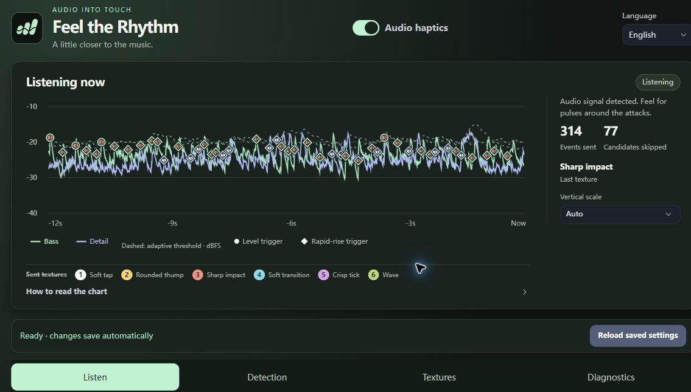
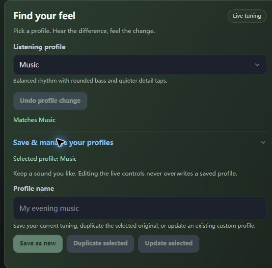
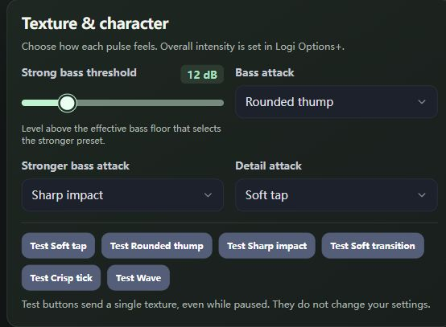
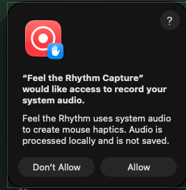
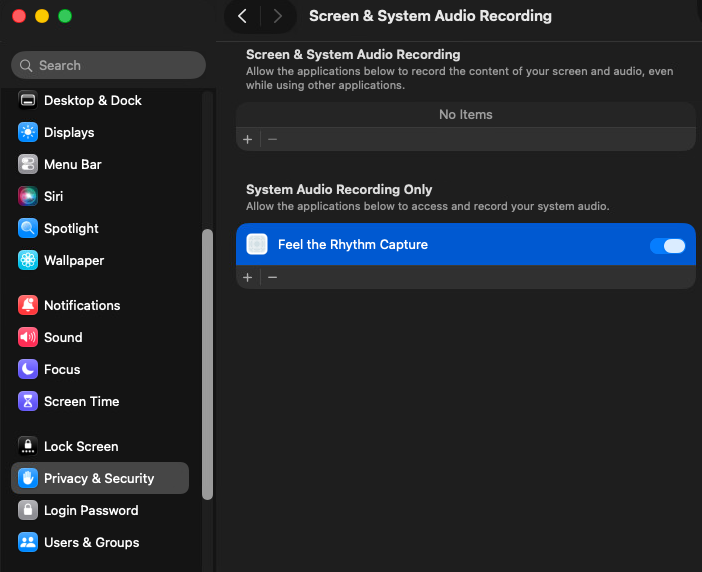

# Feel the Rhythm

Turn music and other audio into haptic feedback on compatible Logitech devices. Follow bass hits and instrument attacks with adjustable taps, impacts, and sustained textures.

## Features

- Choose system playback, a microphone, line-in, or a virtual audio input.
- Adjust sensitivity, bass/detail response, pulse spacing, and haptic textures.
- Start with profiles for music, movies, games, and ambient listening.
- Duplicate profiles and save your own tuning.
- English and Simplified Chinese (简体中文) interfaces.

## Screenshots

Live audio levels, onset markers, and the textures sent to your device:



<details>
<summary>Custom profiles and haptic textures</summary>

**Save your own feel:** choose a profile, duplicate it, and keep your custom tuning.



**Choose pulse character:** assign textures to bass and detail, and try each with a single preview.



</details>

## Compatibility

Requires Logi Options+ and a Logitech device with supported haptic mappings.

**Windows x64 supported · macOS 14.6+ experimental (Intel and Apple Silicon).**

**Tested on:** Logitech MX Master 4. Other compatible haptic devices have not been tested.

**Multiple haptic devices:** settings are shared, and the plugin cannot select an individual haptic output device. Logi Options+ controls event delivery; whether multiple connected devices vibrate together is unverified. The **Audio source** selector chooses the audio to analyze. See [SDK limitations](docs/development.md#haptic-device-targeting).

## Get started

1. Install the plugin package. To build one, see the [developer guide](docs/development.md).
2. In Logi Options+, assign **Open haptic settings** to an Actions Ring slot and activate it.
3. Choose an **Audio source** and press **Use this source**. Select a **Listening profile** and play some audio. Profile changes apply immediately; **Undo profile change** restores your previous tuning.

**macOS:** allow **Feel the Rhythm Capture** to record system audio when prompted. If capture does not start, use **Open system permissions** in browser settings, check **Privacy & Security → Screen & System Audio Recording**, then **Retry audio capture** with Audio haptics enabled. Microphone sources need microphone permission instead. Playback capture currently requires an output-only device; combined speaker/microphone devices may need a different playback output.

<details>
<summary>macOS permission screenshots</summary>

Choose **Allow** when **Feel the Rhythm Capture** requests system-audio access.



To review access later, find **Feel the Rhythm Capture** under **System Audio Recording Only** and enable its switch.



These screenshots are from the tested macOS setup. Icons and layout may differ by macOS and plugin version.

</details>

Use **Language / 语言** in the browser header to switch languages. Options+ action language follows its plugin language setting.

You can also open **Open Haptic Settings.html** from the [plugin configuration and data folder](#plugin-configuration-and-data-folder). Reopen this launcher after a plugin restart instead of bookmarking the temporary browser address.

### Plugin configuration and data folder

**Windows:** paste this into File Explorer's address bar or **Win+R**:

```text
%LOCALAPPDATA%\Logi\LogiPluginService\PluginData\HapticAudioFeedback
```

**macOS:** in Finder, press **Shift+Command+G** (Go to Folder) and paste:

```text
~/Library/Application Support/Logi/LogiPluginService/PluginData/HapticAudioFeedback
```

This is the plugin’s configuration and data folder. Open `Open Haptic Settings.html` to configure the plugin; saved settings and profiles are managed through Logi Options+. Diagnostic logs are in the `logs` subfolder, starting with `feel-the-rhythm.log`. The folder and launcher are created when the plugin loads successfully. On either platform, **Diagnostics → Download logs** collects the retained logs without finding the folder manually.

## Make it yours

Start with **Music**, **Bass focus**, or **Gentle**. Additional profiles cover electronic, rock, acoustic, cinematic, action, and ambient audio. Profiles tune the response; they do not recognize instruments or gameplay events.

**Listening now** sits above four tabs: **Listen** for profiles and audio source, **Detection** for bass/detail trigger controls, **Textures** for pulse character, and **Diagnostics** for capture status and logs. Select a chart legend to jump to its controls. Circles mark level triggers, diamonds rapid-rise triggers, and squares spectral triggers. The chart's vertical range adjusts automatically; choose **Fixed** for a consistent −80 to 0 dBFS view.

Tuning controls save automatically. Sensitivity changes which sounds trigger feedback; overall haptic intensity is controlled in Logi Options+.

In the **Listen** tab, expand **Save & manage your profiles** beneath the profile selector to duplicate a profile, **Save as new** to keep your current tuning, or **Update selected** to replace a saved custom profile. Profile selection preserves your audio source and paused state; the page shows when you have modified a profile.

The **Toggle haptics**, **Select haptic profile**, and **Preview haptic texture** actions are also available in Options+.

## Troubleshooting

- **No audio:** check the selected source and recording permissions, then use **Refresh** or **Retry audio capture**.
- **Too many or delayed pulses:** increase pulse spacing, try softer textures, and disable sustained texture.
- **Settings conflict:** use **Reload saved settings** to load the latest changes.

Turning **Audio haptics** off stops audio capture and analysis. Turn it on to resume. Browser settings remain available while paused.

Audio is processed locally and is not recorded or uploaded.

## Development and license

See the [developer guide](docs/development.md) for building, testing, CI, and implementation details.

[MIT License](LICENSE) · Copyright 2026 computerfan. Third-party license notices are included in plugin packages.
